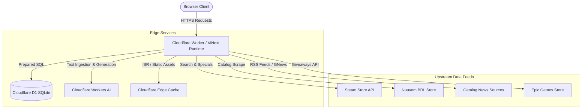
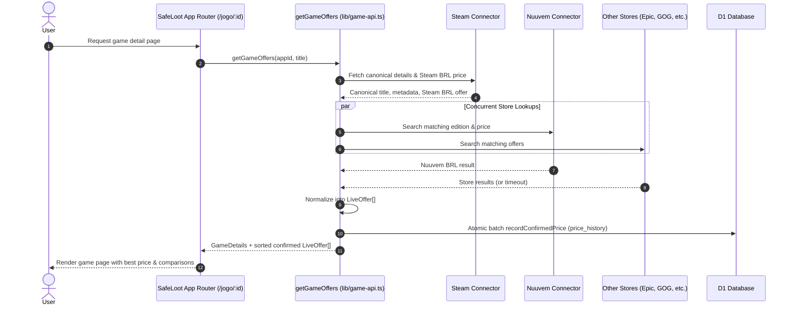
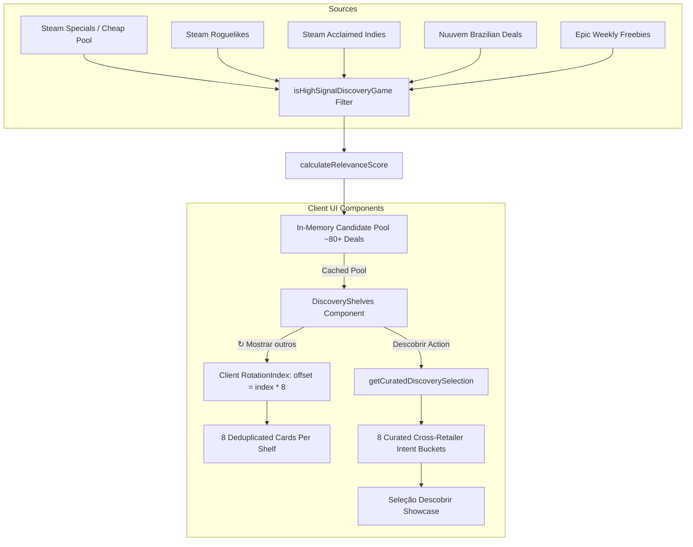

# SafeLoot System Architecture

SafeLoot is a PC game deals aggregator, price comparison engine, and gaming news portal tailored for Brazilian players. The entire stack runs on Cloudflare's serverless edge infrastructure.

---

## 1. Runtime & Stack Overview

* **Framework:** Next.js App Router (React Server Components + Client Components)
* **Build & Bundler:** [ViNext](https://github.com/cloudflare/vinext) (`vinext build`) with Vite / Rolldown
* **Edge Runtime:** Cloudflare Workers with Node.js compatibility (`nodejs_compat`)
* **Database:** Cloudflare D1 (Serverless SQLite at the edge) bound as `env.DB`
* **AI Runtime:** Cloudflare Workers AI bound as `env.AI` (`@cf/meta/llama-3.1-8b-instruct`) with optional OpenAI REST transport fallback



---

## 2. Cloudflare D1 Database Architecture

The relational schema ([`db/schema.ts`](file:///C:/Users/PC/safeloot-game-deals/db/schema.ts)) separates commerce price tracking from news editorial:

### A. Commerce & Catalog Tables
* **`games`:** Canonical game catalog pivoted by `app_id` (integer primary key, matching Steam AppID). Tracks monitoring state (`monitored`) and last checked timestamp (`checked_at`).
* **`store_products`:** Maps canonical `app_id` to retailer-specific products. Compound key serialized as `[appId, store, productId]`. Tracks URL, edition, launcher (Steam, GOG, Epic), region (`BR`), status (`confirmed`), and verification timestamps.
* **`price_history`:** Append-only price observation log. Stores price and original price in **integer BRL cents** (`price_cents`, `original_cents`) to prevent floating-point precision loss. If a price remains identical across checks, `last_seen_at` is extended in-place. If the price returns to an older level, a new row is inserted.
* **`source_health`:** Health status (`ok`, `degraded`, `unavailable`), check timestamp, and diagnostic details per retailer connector.
* **`collection_runs`:** Lock and audit log for background collection jobs with a 10-minute lease preventing overlapping execution.

### B. News Editorial Tables
* **`news_sources`:** Configured RSS, Steam, and GNews feeds with priority and failure tracking.
* **`news_raw_items`:** Ingested articles deduplicated by deterministic content hash (`hash`).
* **`news_events`:** Clustered news events with assigned category, importance score (0–100), purchase impact (`none`, `low`, `medium`, `high`), and `safe_to_publish` flag.
* **`news_articles`:** Published Portuguese editorial articles with lead `summary`, multi-paragraph `body`, `why_it_matters`, and optional `purchase_advice`.
* **`news_article_sources`:** Many-to-one junction mapping published articles back to the raw source items that ground their factual claims.
* **`news_runs`:** Background job run audit trail.

---

## 3. Game Catalog & Price Comparison Flow



### Normalization to `LiveOffer`
Every store connector converts raw retailer data into a uniform [`LiveOffer`](file:///C:/Users/PC/safeloot-game-deals/lib/game-api.ts#L51-L60) structure:
* `finalPrice`: Current price in BRL
* `originalPrice`: Regular non-promotional price in BRL
* `discount`: Calculated discount percentage
* `currency`: Strictly `'BRL'`
* `region`: Strictly `'Brasil'`
* `url`: Direct outbound link with tracking parameters
* `available`: `true` only when price is confirmed; `false` when price is missing or unconfirmed.

---

## 4. Discovery Engine Architecture

The discovery engine power the *"Seu próximo favorito está por aqui"* homepage surface.



### Key Modules:
* **[`lib/discovery.ts`](file:///C:/Users/PC/safeloot-game-deals/lib/discovery.ts):** Anti-shovelware filtering ([`isHighSignalDiscoveryGame`](file:///C:/Users/PC/safeloot-game-deals/lib/discovery.ts#L48)), relevance scoring ([`calculateRelevanceScore`](file:///C:/Users/PC/safeloot-game-deals/lib/discovery.ts#L72)), and multi-source loader ([`getDiscovery`](file:///C:/Users/PC/safeloot-game-deals/lib/discovery.ts#L520)).
* **[`lib/discovery-curation.ts`](file:///C:/Users/PC/safeloot-game-deals/lib/discovery-curation.ts):** Client-safe, zero-dependency curation function ([`getCuratedDiscoverySelection`](file:///C:/Users/PC/safeloot-game-deals/lib/discovery-curation.ts#L3)) that extracts an 8-card cross-retailer mix without pulling server-side database packages into the browser bundle.
* **[`components/discovery-shelves.tsx`](file:///C:/Users/PC/safeloot-game-deals/components/discovery-shelves.tsx):** Interactive client component managing rotation state, store filtering, and responsive rendering.

---

## 5. News Editorial Pipeline

SafeLoot News transforms noisy raw feeds into verified Portuguese gaming journalism.

```mermaid
flowchart LR
  subgraph Collection
    R1[Steam News API] --> Dedupe[lib/news/dedupe.ts]
    R2[Verified RSS Feeds] --> Dedupe
    R3[GNews API] --> Dedupe
  end

  Dedupe --> Group[Event Clustering & Hash Deduplication]
  Group --> Classify[AI Classifier: Category & Purchase Impact]
  
  Classify -->|Safe to Publish| Write[AI Writer: Original PT-BR Prose]
  Classify -->|Rumor or Low Quality| Reject[Reject / Archive]

  Write --> GroundingCheck[checkDeterministicGrounding]
  GroundingCheck -->|Claims Verified| Store[D1 news_articles]
  GroundingCheck -->|Unsupported Claims| Retry[Regenerate or Reject]

  Store --> PublicAPI[/api/news & /noticia/:id]
```

### Grounding Safeguards:
1. **Extraction:** Raw HTML is stripped and converted to raw fact strings in [`lib/news/enrich.ts`](file:///C:/Users/PC/safeloot-game-deals/lib/news/enrich.ts).
2. **Deterministic Pre-Filter:** Pure rumors and speculation are discarded before calling generative models.
3. **Structured Generation:** Cloudflare Workers AI produces structured JSON with explicit claims mapped to source item indices.
4. **Deterministic Post-Check:** [`checkDeterministicGrounding`](file:///C:/Users/PC/safeloot-game-deals/lib/news/ai/grounding.ts#L45) rejects ungrounded performance claims or false purchase advice.

---

## 6. Structured Data (SEO) Architecture

Generated via [`lib/structured-data.ts`](file:///C:/Users/PC/safeloot-game-deals/lib/structured-data.ts) during SSR:
* **Home Page:** Emits `schema.org/ItemList` containing confirmed deals from homepage highlights.
* **Game Detail Pages (`/jogo/:id`):** Emits `schema.org/Product` with nested `AggregateOffer` (`lowPrice`, `highPrice`, `priceCurrency: 'BRL'`).
* **Availability Semantic Separation:** The `availability` property is strictly excluded unless an explicit stock availability signal is provided. Confirmed numeric price proves price truth, not stock truth.

---

## 7. Caching & Background Jobs

* **ISR (Incremental Static Regeneration):** Public catalog and game pages use Next.js ISR (e.g. 120s revalidation) to ensure sub-millisecond edge response times.
* **Price Cron (`/api/cron/prices`):** Runs periodically via GitHub Actions / Cloudflare Triggers. Protected by `Bearer SAFELOOT_ADMIN_TOKEN`. Monitored games are checked in bounded batches with 5-second timeouts.
* **News Cron (`/api/cron/news`):** Runs every 6 hours (scheduled at `47 */6 * * *`). Polls configured news sources, groups events, generates grounded articles, and updates source health.
